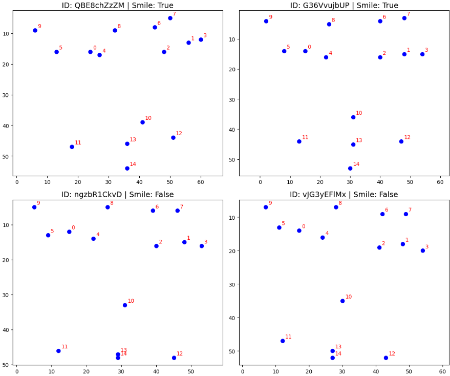
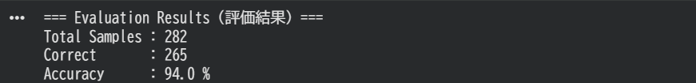

# Smile Detector (顔のランドマークを用いた笑顔推定モデル)

> 15個の顔のKeypoints座標データから、幾何学的な空間正規化と特徴量エンジニアリングを用いて笑顔判定を行う機械学習パイプライン

## Demo / Visuals




## Overview

顔のランドマーク（15個のKeypoints座標）データのみを入力とし、対象者が笑顔であるか否かを判定する推論関数 `smile_predict` の実装です。高精度で高速な推論を実現するため、座標データに対する幾何学的な正規化処理と、ロジスティック回帰を用いたモデルを組み合わせたパイプラインを構築しました。

## Motivation & Challenges

開発初期において、入力される各サンプルの座標群は、被写体とカメラの距離(スケール)、顔の位置(平行移動)、首の傾き(回転)といった空間的なノイズを含んでいました。
抽出した少数の特徴量に対する手動のルールベース判定を初期アプローチとして実装しましたが、約76%の正答率にとどまり、顔の傾きなどのノイズ対応に限界があることがわかりました。この課題を解決するため、数学的なアプローチによる「空間ノイズの完全な排除」と、機械学習モデルを組み合わせた堅牢なロジックを設計しました。

## Tech Stack

* **Language:** Python
* **Machine Learning:** scikit-learn (LogisticRegression)
* **Data Processing & Math:** NumPy
* **Visualization:** Matplotlib

## Key Features & Technical Highlights

### 1. 行列演算を用いた幾何学的正規化 (Geometric Normalization)
NumPyを活用し、全サンプルの顔の向き・大きさ・位置を数学的に統一する正規化プロセスをスクラッチで実装しました。
* **平行移動:** 鼻(点10)を原点(0,0)へ移動し、顔の中心位置を統一しました。
* **スケーリング:** 両目(点0,1)の距離を基準値1.0とし、顔全体の座標系を拡大・縮小しました。
* **回転:** 両目を結ぶベクトルの角度を算出し、回転行列を用いて両目が水平(Y座標が一致)になるよう補正しました。

### 2. ドメイン知識に基づく特徴量エンジニアリング
正規化された15個の座標データに加え、笑顔特有の形状変化を強調するため、以下の特徴量を明示的に計算して結合し、計33次元の特徴量ベクトルを構築しました。
* **Width(口の横幅):** 左右の口角間の距離を算出しました。
* **Height(口の縦の開き):** 上下唇間の距離を算出しました。
* **Curve(スマイルカーブ):** 唇のY座標の平均と、口角のY座標の平均の差分から、口角の引き上がり具合を定量化しました。

### 3. 軽量かつ解釈性の高いモデル設計
33次元にマッピングされた特徴量空間を分割するため、ロジスティック回帰を採用しました。
* 今回の限られた特徴量空間において過学習を起こしにくく、かつパラメータの解釈性が高い点を評価し採用しました。
* 初回の推論実行時にオンメモリでモデルを学習・構築するアーキテクチャを採用しています。

## Results

テストデータを用いた推論検証において、**94.0% (Correct: 265 / Total: 282)** の正答率を達成しました。
幾何学的正規化を導入する前のルールベース手法と比較して、大幅な精度向上が確認されました。

## Installation & Usage (実行方法)

本プロジェクトは、可視化・学習/推論・精度評価の機能ごとにスクリプトを分割し、実務的なモジュール構成で実装しています。

### 1. 環境構築
本リポジトリのコードをお手元の環境に保存し、ターミナルでプロジェクトのルートディレクトリ（`smile-detector` の直下）を開きます。
※ `data/` ディレクトリ内に `facial_keypoints.json` が配置されていることを確認してください。

必要なライブラリをインストールします。
```bash
pip install numpy scikit-learn matplotlib
```
### 2. データの可視化 (EDA)
提供された座標データをグラフ化し、笑顔/非笑顔のKeypointsの違いや空間ノイズの状態を視覚的に確認します。
```bash
python src/eda_visualize.py
```
### 3. モデルの精度評価 (Evaluation)
テストデータを用いてオンメモリでのモデル学習および推論を実行し、予測結果と正解データを突き合わせて正答率（Accuracy）を算出します。
```bash
python src/evaluate.py
```
### 4. 推論モジュールとしての利用
smile_predict.py は、外部のスクリプトからインポートして推論モジュールとして単独利用することが可能です。初回インポート時に自動で学習が走り、推論準備が完了します。
```bash
# ※ srcディレクトリにパスが通っている環境での実行例
from src.smile_predict import smile_predict

sample_face_data = [...] # 15個の座標リストを入力
is_smiling = smile_predict(sample_face_data)
print(f"Smile Predicted: {is_smiling}")
```
